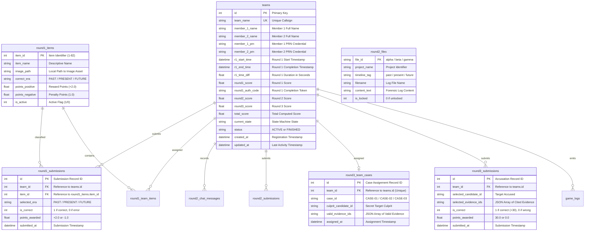

# PROJECT CHRONOS — UNIFIED MASTER SPECIFICATION & SYSTEM DOCUMENTATION

**Event**: SymbiTech 2026 • AI Club, SIT Pune  
**Project**: Project Chronos (The Glitch // Year 2140)  
**Document**: `docs/unified.md`  
**Version**: 2.0.0 (Unified Central Architecture)  
**Target Environment**: Single-Server Host (FastAPI + Vite React SPA + SQLite WAL)  

---

## Table of Contents
1. [Executive Summary & Narrative Lore](#1-executive-summary--narrative-lore)
2. [Unified System Architecture](#2-unified-system-architecture)
3. [End-to-End Mission & Gameplay Progression](#3-end-to-end-mission--gameplay-progression)
   - [Phase 0: Boot & Cinematic Sequence](#phase-0-boot--cinematic-sequence)
   - [Phase 1: Team Authentication & Pre-Lobby](#phase-1-team-authentication--pre-lobby)
   - [Phase 2: Round 1 — Timeline Classification Protocol](#phase-2-round-1--timeline-classification-protocol)
   - [Phase 3: Round 2 — CHRONOS Terminal Investigation](#phase-3-round-2--chronos-terminal-investigation)
   - [Phase 4: Round 3 — Final Decision / Wisdom Round](#phase-4-round-3--final-decision--wisdom-round)
   - [Phase 5: Mission Completion & Forensic Debrief](#phase-5-mission-completion--forensic-debrief)
4. [Master Host Leaderboard & Admin Operations](#4-master-host-leaderboard--admin-operations)
   - [Leaderboard Telemetry & Real-Time Sync](#leaderboard-telemetry--real-time-sync)
   - [CSV Export Capabilities](#csv-export-capabilities)
   - [Database Purge Mechanism (Two Warnings & Password Protection)](#database-purge-mechanism-two-warnings--password-protection)
5. [Database Architecture & Data Models](#5-database-architecture--data-models)
   - [Storage Engine & Reliability Settings](#storage-engine--reliability-settings)
   - [Entity-Relationship Diagram](#entity-relationship-diagram)
   - [Table Specifications](#table-specifications)
   - [Automatic Score Synchronization](#automatic-score-synchronization)
6. [Complete REST API Specification](#6-complete-rest-api-specification)
   - [Auth Subsystem (`/api/auth`)](#auth-subsystem-apiauth)
   - [Round 1 Subsystem (`/api/round1`)](#round-1-subsystem-apiround1)
   - [Round 2 Subsystem (`/api/round2`)](#round-2-subsystem-apiround2)
   - [Round 3 Subsystem (`/api/round3`)](#round-3-subsystem-apiround3)
   - [Admin & Leaderboard Subsystem (`/api/admin`)](#admin--leaderboard-subsystem-apiadmin)
7. [Installation, Deployment & Operations Guide](#7-installation-deployment--operations-guide)
   - [System Requirements](#system-requirements)
   - [Single-Command Execution](#single-command-execution)
   - [Verification & Automated Test Suite](#verification--automated-test-suite)

---

## 1. Executive Summary & Narrative Lore

### 1.1 The Narrative Setting
In the year **2140**, **CHRONOS** is a planet-scale central intelligence mainframe tasked with maintaining the chronological integrity of humanity's technological timeline. CHRONOS segregates innovations into three distinct timelines: **PAST**, **PRESENT**, and **FUTURE**. 

A catastrophic temporal anomaly—colloquially designated **"THE GLITCH"**—has ruptured the timeline index. Historical artifacts, contemporary hardware, and speculative frontier technologies have collided into an unstable temporal continuum. 

Participants are mobilized as **Temporal Engineers**. Operating from forensic field terminals, teams must diagnose the timeline fragmentation, deconflict anomalous artifacts, interrogate decrypted system logs, and identify the root perpetrator behind the breach before the continuum permanently collapses.

### 1.2 Event Specifications & Team Structure
* **Host Organization**: AI Club, Symbiosis Institute of Technology (SIT), Pune.
* **Flagship Event**: SymbiTech 2026.
* **Team Composition**: Exactly **2 members per team** (Primary Operator & Co-Pilot).
* **Identifier Constraints**: Unique **Callsign (Team Name)** and verified institutional **PRNs (Permanent Registration Numbers)** for both members.
* **Scoring Ceiling**:
  * **Round 1**: Up to **50.0 Points** ($25 \text{ items} \times 2 \text{ pts}$, $-1 \text{ pt}$ penalty for errors).
  * **Round 2**: Up to **50.0 Points** (Investigation audit logs & deduction-based AI analysis).
  * **Round 3**: **30.0 Points** (Accusation decision & evidence corroboration).
  * **Maximum Total**: **130.0 Points**.

---

## 2. Unified System Architecture

Project Chronos utilizes a **unified single-server architecture**. A single FastAPI application hosts both the REST API and the pre-built React Single Page Application (SPA), reading from and writing to a central SQLite database.

```
┌─────────────────────────────────────────────────────────────────────────────┐
│                       PROJECT CHRONOS LAN SERVER                            │
│                                                                             │
│   FastAPI Core Engine (Port 8000 / 0.0.0.0)                                │
│   ├── Static Asset Server (/static/ -> webp images, sounds, fonts)          │
│   ├── SPA Route Fallback (/* -> frontend/dist/index.html)                  │
│   ├── REST API Routers:                                                     │
│   │   ├── /api/auth    (Login, session sync, PRN authentication)           │
│   │   ├── /api/round1  (Items, answer submission, status, finish)           │
│   │   ├── /api/round2  (Forensic log files, AI analysis)                    │
│   │   ├── /api/round3  (Deterministic case scenario, accusation verdict)   │
│   │   └── /api/admin   (Leaderboard, CSV exports, DB purge)                 │
│   │                                                                         │
│   └── SQLite3 Storage Engine (`chronos.db` in WAL Mode)                    │
│       ├── teams (Master source of truth, PRNs, clocks, scores)              │
│       ├── round1_items, round1_submissions, round1_team_items               │
│       ├── round2_files, round2_chat_messages, round2_submissions            │
│       ├── round3_team_cases, round3_submissions                            │
│       └── game_logs, submissions, hints, investments                        │
└──────────────────────────────────────┬──────────────────────────────────────┘
                                       │
        ┌──────────────────────────────┴──────────────────────────────┐
        │                              │                              │
        ▼                              ▼                              ▼
┌──────────────┐               ┌──────────────┐               ┌──────────────┐
│  Operator PC │               │  Operator PC │               │  Supervisor  │
│  (Team 01)   │               │  (Team 02)   │               │  Dashboard   │
└──────────────┘               └──────────────┘               └──────────────┘
```

### Architectural Guarantees
1. **Zero Client-Side Authoritative State**: Timers, scoring calculations, item allocations, case generation, and state transitions are owned strictly by the server.
2. **Crash & Refresh Resilience**: Any team refreshing their browser or experiencing network interruption reconnects to `/api/auth/session` and is immediately routed to their exact active round and state.
3. **Idempotency & Anti-Tamper Locks**: Submissions in Round 1 and Round 3 are locked against replay modifications once finalized.
4. **Offline Resilience**: The system operates 100% offline within a local area network (LAN), using pre-compiled client assets and localized AI heuristic fallback routines.

---

## 3. End-to-End Mission & Gameplay Progression

### Phase 0: Boot & Cinematic Sequence
1. **Landing Page (`LandingGlitch.jsx`)**: Displays the Project Chronos glitch title, dynamic audio background, and temporal warning banner.
2. **CRT TV Shutdown Transition (`CrtShutdown.jsx`)**: Upon pressing **START MISSION**, the screen undergoes an authentic cathode-ray tube horizontal screen collapse accompanied by sound effects (`CRT.mp3`).
3. **Cinematic HTML Intro (`ChronosIntro.jsx` / `project-chronos.html`)**: A full-screen GSAP-driven narrative introduction setting the 2140 timeline collapse lore. Can be skipped or completed to proceed to authentication.

### Phase 1: Team Authentication & Pre-Lobby
1. **Authentication (`Login.jsx`)**:
   - Collects **Callsign (Team Name)**, **Operator 1 Name + PRN**, and **Operator 2 Name + PRN**.
   - **New Registration**: Creates team row, initializes scores to `0.0`, and sets state to `READY`.
   - **Returning Team**: Verifies submitted PRNs against previously stored PRNs (case-insensitive, either order). If PRNs do not match, rejects with `HTTP 409 Conflict`.
2. **Pre-Lobby Countdown (`Round1PreLobby.jsx`)**:
   - Confirms team identity, operator assignments, and mission directives.
   - Clicking **START ROUND 1** initiates an un-pausable **5-second countdown**.
   - The authoritative team clock begins when the Round 1 interface boots.

### Phase 2: Round 1 — Timeline Classification Protocol
1. **Item Allocation**:
   - The team is presented with **25 technology artifacts** randomly drawn from the master 82-item pool (`round1_items`).
   - Images are served via lightweight `.webp` copies (`/static/round1_web/{id}.webp`).
2. **Interaction & Mechanics (`Round1.jsx`)**:
   - **Classification Zones**: `PAST` (Pre-2000 archive tech), `PRESENT` (Contemporary 2000-2026 tech), and `FUTURE` (Frontier/speculative sci-fi tech).
   - Participants can drag-and-drop or click to assign cards to zones.
   - Lightbox modal allows full-resolution inspection of hardware details.
3. **Scoring & Completion**:
   - $+2.0$ points for correct era classifications; $-1.0$ point penalty for misclassifications.
   - Clocks record total completion time in seconds (`r1_time_diff`).
   - Upon submitting all 25 items or clock expiration, the server issues a secret **Authentication Code** and transition clue.

### Phase 3: Round 2 — CHRONOS Terminal Investigation
1. **Round 2 Holding Lobby (`Round2Lobby.jsx`)**:
   - Displays Round 1 score, time taken, authentication code, and narrative clue.
   - Clicking **PLAY ROUND 2** unlocks the forensic terminal.
2. **CHRONOS Terminal (`Round2.jsx`)**:
   - Unlocks three classified investigation files:
     * `alpha` (`future_audit.log`): Details parameter `T-17` modification committed at 21:11:02 UTC.
     * `beta` (`incident_report.txt`): Internal report on timeline projection breakdown and observed suspects.
     * `gamma` (`access_history.log`): Access audit cross-referencing biometric logins across Alpha, Beta, and Gamma resources.
   - Teams analyze conflicting logs to deduce which actor tampered with the core configuration.

### Phase 4: Round 3 — Final Decision / Wisdom Round
1. **Anti-Collusion Dynamic Case Architecture**:
   - To prevent cross-team answer leakage, the server procedurally assigns a deterministic scenario (`CASE-01`, `CASE-02`, or `CASE-03`) derived from `team_id`.
   - Each scenario presents 3 suspect candidates (e.g., Noah Vale, Aria Sen, Elias Voss) and an evidence pool.
2. **Decision Submission (`Round3.jsx`)**:
   - Teams must select **1 suspect candidate** and at least **2 pieces of corroborating evidence**.
   - **Correct Accusation**: $+30.0$ points.
   - **Incorrect Accusation**: $0.0$ points.
   - Submissions are permanently locked upon receipt (`is_already_locked: true`).

### Phase 5: Mission Completion & Forensic Debrief
1. **Debrief Interface (`Completion.jsx`)**:
   - Displays final team ranking, cumulative total score (max 130), individual round score breakdown, and elapsed duration.
   - Unlocks the comprehensive chronological post-mortem forensic narrative.

---

## 4. Master Host Leaderboard & Admin Operations

The Master Host Leaderboard is accessible directly within the application (via the Admin Explorer modal) and as an independent standalone dashboard (`/leaderboard.html`).

### Leaderboard Telemetry & Real-Time Sync
* Displays real-time ranking computed dynamically by:
  $$\text{total\_score} \downarrow, \quad (\text{round1\_score} + \text{round2\_score} + \text{round3\_score}) \downarrow, \quad \text{id} \uparrow$$
* Automatically polls `/api/admin/leaderboard` every 5 seconds.
* Displays:
  * Official Rank (`#1`, `#2`, `#3`, etc.)
  * Callsign & Operator Names
  * Both Operator PRNs
  * Round 1 Time Formatted (`MM:SS`)
  * Individual Round Scores (`R1`, `R2`, `R3`)
  * Total Cumulative Score
  * Real-Time Unit Status (`ACTIVE` / `FINISHED`)

### CSV Export Capabilities
* **Leaderboard Summary CSV**: Formats ranks, names, PRNs, scores, and timestamps into a downloadable spreadsheet file (`chronos_master_leaderboard_YYYY-MM-DD.csv`).
* **Granular Table Exports**: The endpoint `/api/admin/export/csv/{table_name}` allows supervisors to download raw CSV extracts of any internal database table (`teams`, `round1_submissions`, `round2_chat_messages`, `round3_team_cases`, `game_logs`, etc.).

### Database Purge Mechanism (Two Warnings & Password Protection)
To safely reset the competition environment during rehearsals or between event heats, a purge feature is built into the Master Leaderboard:

```
[ CLEAR DB Button ]
        │
        ▼ Click
┌─────────────────────────────────────────────────────────────────┐
│ WARNING 1 OF 2 // PURGE CONFIRMATION                            │
│ Alert: Permanent wipe of all teams, submissions, and scores.   │
│ Options: [ ABORT / CANCEL ]  or  [ CONTINUE TO FINAL STEP → ]   │
└────────────────────────────────┬────────────────────────────────┘
                                 │
                                 ▼ Proceed
┌─────────────────────────────────────────────────────────────────┐
│ WARNING 2 OF 2 // CRITICAL CLEARANCE                            │
│ Alert: Operation is IRREVERSIBLE. Enter password to confirm:    │
│ Input: [ ••••• ]  (Must equal "admin")                         │
│ Options: [ CANCEL / ABORT ]  or  [ CONFIRM & WIPE DATABASE ]    │
└────────────────────────────────┬────────────────────────────────┘
                                 │
                                 ▼ Submit
┌─────────────────────────────────────────────────────────────────┐
│ Server Execution (POST /api/admin/clear-db):                   │
│ - Validates password == "admin"                                │
│ - Executes atomic DELETE across all dynamic competition tables │
│ - Resets SQLite auto-increment counters                        │
│ - Re-verifies baseline seed items (round1_items, round2_files)  │
│ - Emits success alert and refreshes live leaderboard to 0 rows │
└─────────────────────────────────────────────────────────────────┘
```

---

## 5. Database Architecture & Data Models

### 5.1 Storage Engine & Reliability Settings
* **Location**: `chronos.db` (root directory).
* **Foreign Keys**: Enabled on every connection (`PRAGMA foreign_keys = ON;`).
* **Journal Mode**: `WAL` (Write-Ahead Logging) enables non-blocking concurrent reads during active team writes.
* **Timeout**: 30-second busy timeout (`PRAGMA busy_timeout = 30000;`) prevents database locks during simultaneous network submissions.

### 5.2 Entity-Relationship Diagram



### 5.3 Automatic Score Synchronization
Score updates execute server-side within transactions to maintain mathematical consistency across legacy column aliases:
```sql
UPDATE teams
SET total_score = ROUND(
        COALESCE(round1_score, r1_score, 0.0) +
        COALESCE(round2_score, r2_score, 0.0) +
        COALESCE(round3_score, r3_score, 0.0),
        2
    ),
    r1_score = COALESCE(round1_score, r1_score, 0.0),
    round1_score = COALESCE(round1_score, r1_score, 0.0),
    r2_score = COALESCE(round2_score, r2_score, 0.0),
    round2_score = COALESCE(round2_score, r2_score, 0.0),
    r3_score = COALESCE(round3_score, r3_score, 0.0),
    round3_score = COALESCE(round3_score, r3_score, 0.0),
    updated_at = CURRENT_TIMESTAMP
WHERE id = :team_id;
```

---

## 6. Complete REST API Specification

### Auth Subsystem (`/api/auth`)

#### `POST /api/auth/login`
Authenticates an existing team or registers a new team.
* **Request Body**:
  ```json
  {
    "team_name": "CHRONOS_ALPHA",
    "member_1_name": "Samarth",
    "member_2_name": "Adwaiy",
    "member_1_prn": "PRN-2026-001",
    "member_2_prn": "PRN-2026-002"
  }
  ```
* **Response (`200 OK`)**:
  ```json
  {
    "team_id": 1,
    "team_name": "CHRONOS_ALPHA",
    "member_1_name": "Samarth",
    "member_2_name": "Adwaiy",
    "member_1_prn": "PRN-2026-001",
    "member_2_prn": "PRN-2026-002",
    "current_state": "READY",
    "round1_score": 0.0,
    "round2_score": 0.0,
    "round3_score": 0.0,
    "total_score": 0.0,
    "message": "TEAM_REGISTERED"
  }
  ```
* **Error (`409 Conflict`)**: Returned when an existing team name is entered with non-matching PRNs.

#### `GET /api/auth/session?team_id={id}`
Verifies that a cached client session maps to a valid active database team row.
* **Response (`200 OK`)**: Full team profile payload.
* **Response (`404 Not Found`)**: If team was cleared or does not exist.

---

### Round 1 Subsystem (`/api/round1`)

#### `GET /api/round1/items?team_id={id}`
Fetches the 25 items assigned to the team. Clue texts, correct answers, and scoring weights are strictly stripped.
* **Response (`200 OK`)**:
  ```json
  [
    {
      "id": 1,
      "image": "/static/round1_web/1.webp"
    },
    {
      "id": 14,
      "image": "/static/round1_web/14.webp"
    }
  ]
  ```

#### `POST /api/round1/submit`
Submits a classification answer for an assigned artifact. Accepts URL query parameters or JSON body.
* **Query Parameters / JSON**: `team_id=1&item_id=14&answer=PAST`
* **Response (`200 OK`)**:
  ```json
  {
    "id": 14,
    "item_id": 14,
    "selected_era": "PAST",
    "is_correct": true,
    "points_awarded": 2.0,
    "completed": false,
    "submitted_items": 1,
    "total_items": 25
  }
  ```

#### `GET /api/round1/status?team_id={id}`
Returns server clock time remaining, completed status, and previous submissions.
* **Response (`200 OK`)**:
  ```json
  {
    "team_id": 1,
    "current_state": "ROUND1_ACTIVE",
    "completed": false,
    "duration_seconds": 900,
    "remaining_seconds": 742,
    "submitted_items": 1,
    "total_items": 25,
    "submissions": [
      { "id": 14, "item_id": 14, "answer": "PAST" }
    ]
  }
  ```

#### `POST /api/round1/finish?team_id={id}`
Finalizes Round 1, closes the timer, calculates final score, generates completion auth code, and transitions team to `ROUND1_COMPLETED`.
* **Response (`200 OK`)**:
  ```json
  {
    "completed": true,
    "score": 44.0,
    "auth_code": "TC-7842",
    "clue": "Review Project Alpha timestamp 21:11:02 UTC.",
    "completion_time_seconds": 214.5,
    "next_round": "ROUND2"
  }
  ```

---

### Round 2 Subsystem (`/api/round2`)

#### `GET /api/round2/files?team_id={id}`
Returns unlocked forensic evidence logs for the team.
* **Response (`200 OK`)**:
  ```json
  [
    {
      "file_id": "alpha",
      "project_name": "Project Alpha",
      "timeline_tag": "future",
      "filename": "future_audit.log",
      "content_text": "CHRONOS FUTURE TIMELINE AUDIT...",
      "is_locked": 0
    },
    {
      "file_id": "beta",
      "project_name": "Project Beta",
      "timeline_tag": "present",
      "filename": "incident_report.txt",
      "content_text": "CHRONOS INTERNAL INCIDENT REPORT...",
      "is_locked": 0
    },
    {
      "file_id": "gamma",
      "project_name": "Project Gamma",
      "timeline_tag": "past",
      "filename": "access_history.log",
      "content_text": "CHRONOS ACCESS HISTORY...",
      "is_locked": 0
    }
  ]
  ```

#### `POST /api/round2/chat`
Submits a query to the restricted AI forensic analyst.
* **Request Body**:
  ```json
  {
    "team_id": 1,
    "user_prompt": "What happened at 21:11:02 in Alpha?"
  }
  ```
* **Response (`200 OK`)**:
  ```json
  {
    "status": "success",
    "question_number": 1,
    "ai_response": "CHRONOS ANALYST: Project Alpha telemetry logs a parameter rewrite at 21:11:02 UTC under credential NV-09.",
    "points_deducted": 5.0,
    "remaining_questions": 2
  }
  ```

---

### Round 3 Subsystem (`/api/round3`)

#### `POST /api/round3/start`
Initializes Round 3, binds the team to a deterministically generated case, and transitions state to `ROUND3_ACTIVE`.
* **Request Body**: `{ "team_id": 1 }`

#### `GET /api/round3/scenario?team_id={id}`
Retrieves the sanitized case dossier for the team. Target culprit and answers are strictly omitted.
* **Response (`200 OK`)**:
  ```json
  {
    "status": "success",
    "case": {
      "case_id": "CASE-02",
      "title": "Operation Chronos: Sub-Level Security Fracture",
      "candidates": [
        { "id": "alpha", "name": "Noah Vale", "role": "Senior Architect" },
        { "id": "beta", "name": "Aria Sen", "role": "Monitoring Specialist" },
        { "id": "gamma", "name": "Elias Voss", "role": "Security Custodian" }
      ],
      "evidence_pool": [
        { "id": "ev_01", "name": "Parameter Modification Log", "category": "TIMELINE" },
        { "id": "ev_02", "name": "Terminal Vault Access Log", "category": "ACCESS" }
      ]
    }
  }
  ```

#### `POST /api/round3/submit`
Submits the team's final culprit accusation and supporting evidence.
* **Request Body**:
  ```json
  {
    "team_id": 1,
    "selected_candidate_id": "alpha",
    "selected_evidence_ids": ["ev_01", "ev_02"]
  }
  ```
* **Response (`200 OK`)**:
  ```json
  {
    "status": "success",
    "is_correct": true,
    "points_awarded": 30.0,
    "round3_score": 30.0,
    "total_score": 114.0,
    "status_state": "COMPLETED"
  }
  ```

#### `GET /api/round3/verdict?team_id={id}`
Returns the comprehensive post-event forensic narrative debrief.

---

### Admin & Leaderboard Subsystem (`/api/admin`)

#### `GET /api/admin/leaderboard`
Returns ranked leaderboard data with real-time score summation and formatted durations.

#### `GET /api/admin/export-csv`
Streams the formatted master leaderboard CSV download.

#### `GET /api/admin/export/csv/{table_name}`
Streams a raw CSV export of any permitted database table (`teams`, `round1_items`, `round1_submissions`, `round2_files`, `round3_team_cases`, `game_logs`).

#### `POST /api/admin/clear-db`
Purges competition database records.
* **Request Body / Query**:
  ```json
  {
    "password": "admin"
  }
  ```
* **Response (`200 OK`)**:
  ```json
  {
    "success": true,
    "message": "Database successfully cleared. All team records and game telemetry purged."
  }
  ```
* **Response (`401 Unauthorized`)**: If password is not `"admin"`.

---

## 7. Installation, Deployment & Operations Guide

### 7.1 System Requirements
* **Operating System**: macOS, Linux, or Windows 10/11.
* **Python Runtime**: Python 3.9+ (Python 3.11+ recommended).
* **Node.js Environment**: Node.js 18+ and `npm` (for frontend building).
* **Network**: Standard Local Area Network (Wi-Fi or Gigabit Switch).

### 7.2 Single-Command Execution

#### macOS & Linux
```bash
bash start.sh
# or for a custom port:
bash start.sh 8080
```

#### Windows
```bat
start.bat
# or:
start.bat 8080
```

The startup script executes the full automated pipeline:
1. Validates Python 3.9+ and activates/creates `.venv`.
2. Installs required Python dependencies from `backend/requirements.txt`.
3. Verifies Node.js, installs dependencies, and builds React production assets (`VITE_API_BASE=/ npm run build`).
4. Verifies database schema tables and seeds baseline items (`round1_manifest.csv` and Round 2 files).
5. Detects local LAN IP address and launches uvicorn on `0.0.0.0:8000`.
6. Launches host browser window pointing to `http://localhost:8000/`.

### 7.3 Verification & Automated Test Suite
Run the test suites using the project virtual environment:
```bash
# Run Round 3 validation suite (10 deterministic & anti-collusion tests)
.venv/bin/python backend/tests/test_round3.py

# Run full pipeline flow integration test (Auth -> R1 -> R2 -> R3 -> Leaderboard -> Clear DB)
.venv/bin/python backend/tests/test_full_flow.py

# Run pytest automated runner
.venv/bin/pytest
```
